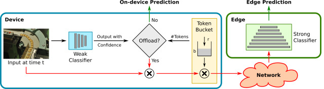

# Edge Classification with a Token Bucket MDP



This is a python implementation of the algorithm described in the paper below
for computing optimal offloading policies, as well of simulation and testing
code to evaluate these policies:

[Ayan Chakrabarti, Roch Guérin, Chenyang Lu, and Jiangnan Liu, **"Real-time Edge
Classification: Optimal Offloading under Token Bucket Constraints,"**
arXiv:2010.13737 [cs.LG], 2020.](https://arxiv.org/abs/2010.13737)

## Requirements

We recommend installing a recent Python 3.7+ distribution of
[Anaconda](https://www.anaconda.com/products/individual). The code uses `numpy`
for numeric computation, `numba` to enable JIT compilation and speed-up of the
simulation code, `multiprocessing` to run tests for different parameters in
parallel, and `matplotlib` to visualize results in jupyter notebooks.

## Policy Computation and Simulation

The actual library for computing policies and simulating transmissions and
rewards with these policies is in the [eomdp](eomdp/) directory. Please take a
look at its [README.md](eomdp/README.md) file for documentation.

## Simulation Results and Data

You may either download and use our pre-computed results, or re-run experiments
yourself.

### Download pre-computed results

From the repository directory, run the following commands in your shell:

``` shell
wget https://github.com/ayanc/edgeml.mdp/releases/download/v1.0/save_data.zip
unzip save_data.zip
```

This will extract all data files into the `save/` sub-directory. You should then
be able to directly run the note-books in the visualization step.

### Generate results

You will need to first download an `npz` file containing the outputs and
performance of the weak and strong
[OFA](https://github.com/mit-han-lab/once-for-all) classifiers used in our
simulations. Do this by running the following command in your shell from the
repository directory:

```shell
wget https://github.com/ayanc/edgeml.mdp/releases/download/v1.0/ofa_imgnet.npz
```

After that, run the following test scripts in sequence for the **single device
experiments**. Note that these scripts will run in parallel spawning a pool of
processes based on all available CPU cores on the machine.

``` shell
./runtest_fmetric.py  # Runs tests to fit entropy to metric separately for each fold.
./runtest_single.py   # Runs single device simulations for various (r,b) values.
./runtest_robust.py   # Runs experiments with train-test mismatch to measure robustness.
```

Then, to run experiments for the multi-device experiments, run the following
tests in sequence. Note that since this requires doing a grid-search for every
setting of (r_tot, b_tot, #camera) for the hierarchical strategy, this might
take a while.

``` shell
./runtest_mcpolicies.py  # Generate policies for all possible r_i, b_i
./runtest_mcsim.py       # Simulate each policy with each setting on training set.
./runtest_mcam.py       # Generate final results.
```

## Visualization

We provide separate jupyter notebooks to visualize (either downloaded or
generated) results, producing the figure included in the paper (and more).

- [metricfit-viz.ipynb](metricfit-viz.ipynb) - Illustrating metric mapping and statistics.
- [single-camera-viz.ipynb](single-camera-viz.ipynb) - Single camera policies and performance.
- [robustness-viz.ipynb](robustness-viz.ipynb) - Performance under train-test mismatch.
- [multi-camera-viz.ipynb](multi-camera-viz.ipynb) - Performance of various multi-device strategies.

## License

This code is being released under the [MIT License](LICENSE). Note that the OFA
results file were generated from the [models and
code](https://github.com/mit-han-lab/once-for-all) provided by its authors.

## Acknowledgments

This work was partially supported by the National Science Foundation under award
no. CPS-1646579. Any opinions, findings, and conclusions or recommendations
expressed in this material are those of the authors, and do not necessarily
reflect the views of the National Science Foundation.
